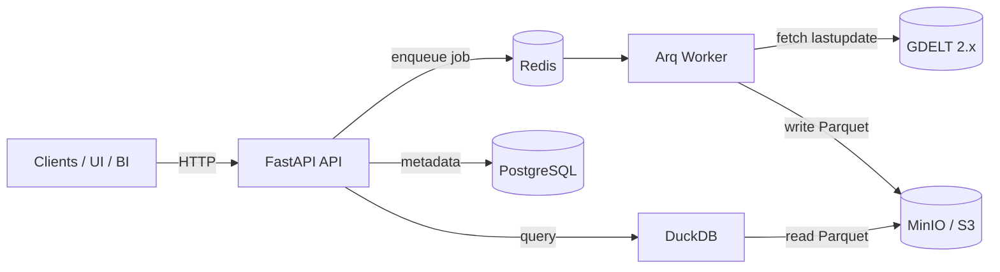

# Architecture — FastAPI Haute Performance (GDELT Big Data)

## Vue d’ensemble (composants)

- **FastAPI (API Gateway)** : exposition REST, validation, auth (extensible), métriques, logs JSON.
- **Redis + Arq Worker** : jobs asynchrones d’ingestion (non-bloquant).
- **GDELT** : source open data massive, mise à jour fréquente.
- **Data Lake (MinIO/S3)** : stockage durable en **Parquet** partitionné (`dt=YYYY-MM-DD`).
- **DuckDB** : moteur analytique ultra-rapide pour lire les Parquet (POC: téléchargement local des partitions).
- **PostgreSQL** : (prévu) métadonnées d’ingestion, état, audit, catalog. (Le modèle existe; la v3 activera l’écriture systématique.)

## Diagramme (Mermaid)

## Flux d’ingestion

1. L’API déclenche une ingestion (endpoint `POST /api/v1/ingest/trigger`).
2. Un job est enqueued dans Redis.
3. Le worker récupère `lastupdate.txt`, sélectionne les N derniers lots `export` (Events).
4. Il télécharge le zip, extrait le CSV, écrit un fichier **Parquet ZSTD**.
5. Il uploade dans MinIO/S3 sous `events/dt=.../batch_ts=....parquet`.

## Flux de requête

- `GET /api/v1/events/search` lance une requête DuckDB sur les Parquet.
- **POC** : téléchargement des Parquet en local puis `read_parquet()`.
- **Prod** : DuckDB peut lire S3 via `httpfs` + pruning partitions + catalog.

## Points industriels (v3/v4)

- Catalog de partitions (Postgres) + pruning efficace.
- DuckDB `httpfs` (S3 direct) + credentials via IAM.
- Auth (JWT/OAuth2) + RBAC.
- OTel traces (FastAPI + HTTPX + DB).
- Benchmark CI (k6) + SLO p95.
